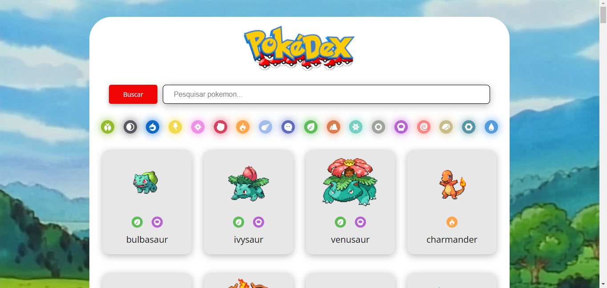

<h1 align="center">🕹️ Pokedex 🕹️</h1>

Este repositório contém a implementação de uma página web Pokedex do anime clássico japones Pokemon. Este projeto faz parte do curso de JavaScript Completo ministrado pela <a href="https://cursos.dankicode.com/">Daki Code</a>, visando aprofundar as hanilidades em programação front-end.

  <a href="#🔖-layout">Layout</a>&nbsp;&nbsp;&nbsp;|&nbsp;&nbsp;&nbsp;
  <a href="#🚀-tecnologias">Tecnologias</a>&nbsp;&nbsp;&nbsp;|&nbsp;&nbsp;&nbsp;
  <a href="#💻-projeto">Projeto</a>&nbsp;&nbsp;&nbsp;

## 🔖 Layout

  

## 🚀 Tecnologias

Esse projeto foi desenvolvido com as seguintes tecnologias:

- HTML e CSS
- JavaScript
- Git e Github
- API

## 💻 Projeto

Um emocionante projeto web da Pokédex do anime foi recriado, proporcionando aos entusiastas a oportunidade de explorar informações essenciais sobre os Pokémon. Esses detalhes incluem os nomes distintos, os tipos característicos e fascinantes imagens visuais de cada um. Este projeto foi cuidadosamente elaborado, focalizando exclusivamente nos primeiros 151 Pokémon da amada série, utilizando a rica base de dados da <a href="https://pokeapi.co/">PokeApi</a>.

- [Acesse o projeto finalizado, online](https://jp-xaxa.github.io/pokedex)

<h1 align="center">
  Funcionalidades
</h1>

A implementação incorpora uma interface de usuário que apresenta um design simples e amigável. Adicionalmente, foi atentamente implementada a responsividade do projeto, assegurando sua adaptabilidade para uma variedade de tamanhos de tela.
